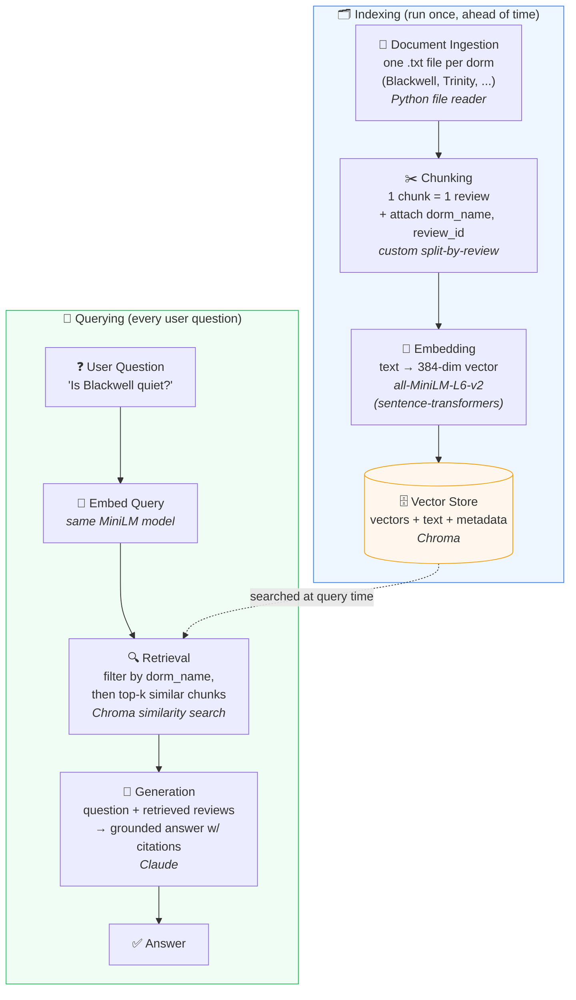

# Project 1 Planning: The Unofficial Guide

> Write this document before you write any pipeline code.
> Your spec and architecture diagram are what you'll use to direct AI tools (Claude, Copilot, etc.) to generate your implementation — the more specific they are, the more useful the generated code will be.
> Update the Retrieval Approach and Chunking Strategy sections if you change your approach during implementation.
> Update this file before starting any stretch features.

---

## Domain

<!-- What domain did you choose? Why is this knowledge valuable and hard to find through official channels? -->
I chose dorm reviews at Duke University. This knowledge is valuable because as a freshman coming into Duke I had no visibility into what the dorms are like. Official channels don't give the real scoop like student reviews do.

---

## Documents

<!-- List your specific sources: URLs, subreddit names, forum threads, or file descriptions.
     Aim for at least 10 sources that together cover different subtopics or perspectives within your domain. -->

| # | Source | Description | URL or location |
|---|--------|-------------|-----------------|
| 1 | Ratemydorm.com| 4 reviews for Basset dorm | https://www.ratemydorm.com/reviews/duke-university/duke-university-bassett |
| 2 | Ratemydorm.com| 4 reviews for Wilson dorm | https://www.ratemydorm.com/reviews/duke-university/duke-university-wilson |
| 3 | Ratemydorm.com| 4 reviews for Giles dorm | https://www.ratemydorm.com/reviews/duke-university/duke-university-giles |
| 4 | Ratemydorm.com| 3 reviews for Keohane quad | https://www.ratemydorm.com/reviews/duke-university/duke-university-keohane-quad |
| 5 | Ratemydorm.com| 3 reviews for Trinity dorm | https://www.ratemydorm.com/reviews/duke-university/duke-university-trinity |
| 6 | Ratemydorm.com| 3 reviews for Wannamaker quad | https://www.ratemydorm.com/reviews/duke-university/duke-university-wannamaker-quad |
| 7 | Ratemydorm.com| 2 reviews for Blackwell dorm | https://www.ratemydorm.com/reviews/duke-university/duke-university-blackwell |
| 8 | Ratemydorm.com| 2 reviews for Craven quad | https://www.ratemydorm.com/reviews/duke-university/duke-university-craven-quad |
| 9 | Ratemydorm.com| 2 reviews for Kilgo quad | https://www.ratemydorm.com/reviews/duke-university/duke-university-kilgo-quad |
| 10 |Ratemydorm.com| 2 reviews for Randolph | https://www.ratemydorm.com/reviews/duke-university/duke-university-randolph |

---

## Chunking Strategy

<!-- How will you split documents into chunks?
     State your chunk size (in tokens or characters), overlap size, and explain why those numbers fit the structure of your documents.
     A review-heavy corpus warrants different chunking than a long FAQ. -->

**Chunk size:**
1 chunk ≈ 1 review (split on the `---` delimiter between reviews). Reviews range from ~20 to ~265 words, so most reviews map cleanly to a single chunk.

**Token-limit guardrail:** `all-MiniLM-L6-v2` has a max sequence length of 256 tokens and *silently truncates* anything longer (~190 English words). If a single review exceeds ~200 words / ~256 tokens, sub-split it on paragraph/sentence boundaries so no text is dropped from the embedding. In the current corpus this triggers on exactly one review (Basset, ~265 words); every other review fits in one chunk.

**Overlap:**
Zero overlap *between* different reviews — they're distinct opinions with a clean `---` delimiter, so overlap would only blur boundaries. The one exception: if a long review is sub-split, use a small (~1 sentence) overlap *within* that review so a sentence straddling the split isn't lost. Sub-chunks of the same review share one `review_id`.

**Reasoning:**
The documents are short, opinionated reviews not long-form prose, so we want a single/few ideas per chunk for high retrieval precision; large chunks would mix multiple topics and lower precision. One-review-per-chunk fits the data -- only 1 of 28 reviews is long enough to need sub-splitting, so fixed-character chunking would needlessly fragment the other 27 clean reviews. The sub-split rule exists only to respect the embedding model's 256-token ceiling.

## Retrieval Approach

<!-- Which embedding model are you using (e.g., all-MiniLM-L6-v2 via sentence-transformers)?
     How many chunks will you retrieve per query (top-k)?
     If you were deploying this for real users and cost wasn't a constraint, what tradeoffs would you weigh in choosing a different embedding model — context length, multilingual support, accuracy on domain-specific text, latency? -->
Retrieval will mainly be semantic search (good for paraphrased opinions), scoped by dorm via metadata filtering (i.e. adding dorm_name metadata to each chunk/document since documents are separated by dorm). Hybrid retrieval with a mix of lexical and semantic approach and reranking are known upgrades I would add if exact-term queries became an issue with real users, but for now I'll stick with the basics

**Embedding model:**

all-MiniLM-L6-v2

**Top-k:**

k=5 (should probably test, trial and error)

**Production tradeoff reflection:**

If this was a production project for real user without cost as a constraint, I would definitely choose a higher dim model that's paid. all-MiniLm is perfectly fine for what we are doing in this course though. Also for short reviews like the ones about Duke dorms, embedding model doesn't matter too much since the context of each chunk is already pretty small. Multilingual support also wouldn't matter much since this is an English speaking university and all students need to speak English to go to Duke. 

## Evaluation Plan

<!-- List your 5 test questions with their expected correct answers.
     Questions should be specific enough that you can judge whether the system's response
     is right or wrong. "What are good dining halls?" is too vague.
     "What do students say about wait times at [dining hall name] during lunch?" is testable. -->

| # | Question | Expected answer |
|---|----------|-----------------|
| 1 | What are the room sizes like in Randolph? | Users reported the rooms as small but creating good community |
| 2 | Does Basset have a mold problem? | Some users reported mold in the rooms in Basset |
| 3 | How are the bathrooms in Wilson? | The bathrooms are suite style which users reported liking but also that they had to clean after themselves |
| 4 | Is it easy to make friends in Giles dorm? | Users report that the community in Giles in better than other dorms and that community is built quickly |
| 5 | What are the rooms like in Keohane quad? | Users report medium-sized spacious rooms with large windows letting in natural light. |

---

## Anticipated Challenges

<!-- What could go wrong? Name at least two specific risks with reasoning.
     Consider: noisy or inconsistent documents, missing source attribution, off-topic
     retrieval, chunks that split key information across boundaries. -->

1. Students will inevitably ask "Is Blackwell or Trinity quieter?" That requires retrieving and comparing across two documents. A naive top-k might return 4 Blackwell chunks and 0 Trinity ones, giving a one-sided answer. 

Mitigation: detect multi-dorm queries and retrieve top-k per dorm, then let the LLM compare.

2. Lack of data per document. I have only 3–4 reviews per dorm. If 2 of 3 Blackwell reviewers happened to hate the AC, the guide will confidently report "Blackwell has bad AC", when that's really two people, possibly from the same hot summer.

Mitigation: surface how many reviews support a claim, and/or have the LLM hedge ("one reviewer mentioned…" vs "multiple reviewers said…").

---

## Architecture

<!-- Draw a diagram of your pipeline showing the five stages:
     Document Ingestion → Chunking → Embedding + Vector Store → Retrieval → Generation
     Label each stage with the tool or library you're using.
     You can use ASCII art, a Mermaid diagram, or embed a sketch as an image.
     You'll use this diagram as context when prompting AI tools to implement each stage. -->

---

## AI Tool Plan

<!-- For each part of the pipeline below, describe:
     - Which AI tool you plan to use (Claude, Copilot, ChatGPT, etc.)
     - What you'll give it as input (which sections of this planning.md, which requirements)
     - What you expect it to produce
     - How you'll verify the output matches your spec

     "I'll use AI to help me code" is not a plan.
     "I'll give Claude my Chunking Strategy section and ask it to implement chunk_text()
     with my specified chunk size and overlap" is a plan. -->

**Milestone 3 — Ingestion and chunking:**
- **Tool:** Claude
- **Input:** My chunking strategy outlined earlier in this file, plus a sample dorm `.txt` file so Claude sees the real format. I'll specify: one chunk = one review, split on my file's review delimiter, and attach `dorm_name` (from the filename) and `review_id` as metadata.
- **Expected output:** A `load_documents()` function that reads every `.txt` in `documents/` with Python's built-in file reader, and a `chunk_text()` function that splits each file into one chunk per review and returns a list of `{text, dorm_name, review_id}` objects.
- **Verification:** Run it on my real files and print the chunks. I'll check that (a) the chunk count equals my total number of reviews *plus* any sub-chunks from long reviews (currently 28 reviews → 29 chunks, since one Basset review sub-splits), (b) no chunk is split mid-review *except* the deliberate long-review sub-split, and sub-chunks of the same review share a `review_id`, and (c) every chunk carries the correct `dorm_name`.

**Milestone 4 — Embedding and retrieval:**
- **Tool:** Claude
- **Input:** My retrieval approach section, choice of embedding model (`all-MiniLM-L6-v2`), vector db (ChromaDB), top-k value, and the requirement to filter by `dorm_name` before semantic ranking. I'll give it the chunk objects from Milestone 3 as the data shape.
- **Expected output:** An `embed_and_store()` function that embeds each chunk and writes it to ChromaDB with its metadata, and a `retrieve(query, dorm=None)` function that embeds the query with the *same* model and returns the top-k most similar chunks, optionally filtered by dorm.
- **Verification:** Call `retrieve()` directly in a test script (no LLM or interface yet — retrieval is tested in isolation) and print the returned chunks. Using test queries where I know the answer (e.g., "Is Blackwell quiet?"), I'll confirm the reviews that actually discuss the topic appear in the top-k, and that a dorm-filtered query returns only that dorm's reviews. Testing retrieval before generation exists means any later wrong answer can be isolated to the generation stage rather than retrieval.

**Milestone 5 — Generation and interface:**
- **Tool:** Claude.
- **Input:** My retrieval function plus a generation prompt spec — the LLM should answer *only* from retrieved reviews, cite which review each claim comes from, and hedge when only one reviewer supports a claim (mitigating my small-sample-consensus risk).
- **Expected output:** A `generate_answer(query)` function that retrieves chunks, builds a grounded prompt, and calls the LLM (Groq); plus a simple **Gradio** chat interface where a user types a question and sees the answer with its sources.
- **Verification:** Ask questions whose answers I can check against the source reviews, and confirm the answer is grounded (no invented facts) and cites the correct reviews. I'll also ask an off-topic question (e.g., about a dorm with no reviews) to confirm it says "I don't have information" instead of hallucinating.